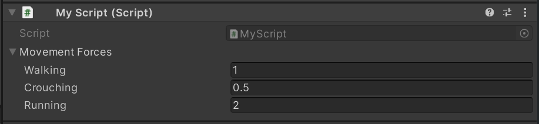

# EnumDict

[](https://openupm.com/packages/dev.comradevanti.enum-dict/)

A Unity package for associating a value with each case of an enum. Allows
setting values in the inspector and serialization.

## Installation

The quickest way is to install via [OpenUPM](https://openupm.com)
using `openupm add dev.comradevanti.enum-dict`.

Or install manually
as [git dependency](https://docs.unity3d.com/Manual/upm-ui-giturl.html)
from `https://github.com/ComradeVanti/EnumDict.git` or download as zip
and [import locally](https://docs.unity3d.com/Manual/upm-ui-local.html).

## Usage

Say, you want to associate a movement-force for a rigidbody with each possible
movement state. You could do this by first defining an enum for it like this.

```csharp
public enum MovementState
{

    Walking,
    Crouching,
    Running

}
```

Next create a variable for the `EnumDict` in your script. All serializable types
are valid, such as strings, serializable classes and structs or in this case,
floats.

```csharp
public class MyScript : MonoBehaviour
{

    public EnumDict<MovementState, float> movementForces;

}
```

You can then edit it from the inspector.



To access the value for a specific enum-case, use the indexer syntax.

```csharp
// 0.5
var force = movementForces[MovementState.Crouching];
```